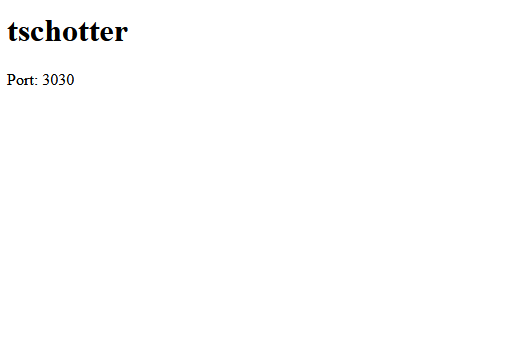
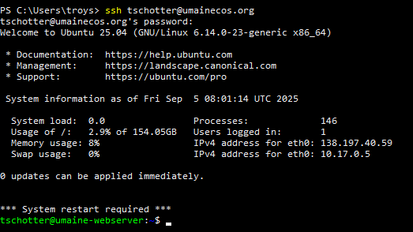

# Accessing Server

[&laquo; Return to Setup](index.md)

## Overview

This section covers how to access and connect to the public server (that is shared with everyone).

## Prerequisites

- [ ] Account Exists on the sever (Troy set it up)
- [ ] Access to the internet
- [ ] A terminal program (comes default with any computer operating system)

## Steps

### 1. Getting your account credentials

1. Go to [umainecos.org](https://umainecos.org)
2. Look for the name that matches your email address. Each name coresponds to the email for the University system, shortened to be your first initial and your last name. As an example, troy.schotter -> tschotter.
3. Write this down somewhere since this is going to be your user name and initial password to log into your account.

### 2. Verify account page.

1. Click on your name on the base webpage to navigate to your template page.
2. Confirm that your page exists (and doesn't lead to a 404 error). It should look simular to this:



### 3. Connect 

1. Open a terminal with ssh capabilties.
    - For windows, cmd or powershell works
    - For Mac or Linux, it's just called "Terminal"

2. Connect to the server with an ssh command.
```
ssh [username]@umainecos.org
```

In practice it will look like this if your username was "tschotter":
```
ssh tschotter@umainecos.org
```
> **What is SSH?**
> 
> SSH stands for "Secure Shell" and is a protocol that allows you to securely connect to remote computers over a network. It's like having a secure tunnel between your computer and the server.
> The port used for this service is typically 22, but it is not limited to this port. Sometimes this type of connection is intentionally set to a different port for security reasons. Many vulnerability scanning bots are constantly probing servers across the internet on the commonly used ports.  


When you connect for the first time, it will ask you if you trust the server that you're connecting to. Make sure to reply "yes" to the terminal. 

If all goes well, the server will ask you for your password. Your password is the same as your username at first.

**You will not see what characters you type in for the password**. This is a security measure to prevent onlookers from seeing what you type as a password (or even how many characters it has) on your screen.

Once you successfully log in, you should see something like this:



Congradulations! You're now logged into the remote server through your terminal.


## Troubleshooting

### Common Issues

- **404 Template page**: 
    - Double check your internet connection. If you're on the school wireless connection, try to access the page on your phone through your dataplan.
    - Try to access the page after clearing the cache. This can also be quickly checked on a different browser or through a new private window (incognito) to clear the cache.
    - Sometimes, the webserver is down. Check other student pages to see if their site is accessable.

- **Connection refused**: 
    - Make sure you've typed everything in correctly with your ssh command. Check the spelling on the site name and your username.
- **Authentication failed**: 
    - Just because you typed the password in correctly doesn't mean it will let you log in. If you mistyped your username on the ssh connection request, it will be like you trying to log into an account that doesn't exist. The server will not tell you that the account doesn't exist for security reasons.

## Next Steps

Once you've successfully accessed the server, proceed to [Basic Linux Navigation](linuxNavigation.md).

---
