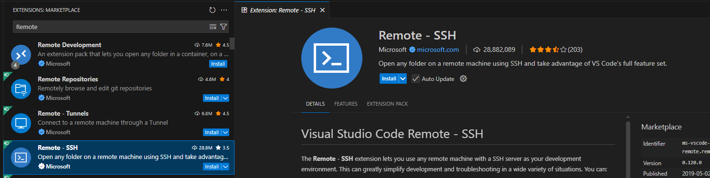

# VSCode Extension

[&laquo; Return to Setup](index.md)

## Overview

Set up VSCode to both connect to the server, allowing you access to the teriminal, and also modify files through the VSCode IDE.

## Required Extensions

- Remote SSH

## Installation Steps

### 1. Install Extensions

1. Open VSCode
2. Click on the Extensions icon in the sidebar (or press `Ctrl+Shift+X`)

3. Search for the Remote SSH extension

4. Click "Install".

### 2. Running the Extension

> **WARNING**: Highly recommend you restart VSCode once the extension is installed

1. Hit **F1** (Windows/Linux) or **Cmd+Shift+P** (Mac) on your keyboard to open the Command Palette

2. Type "Remote-SSH" and select "Remote-SSH: Connect to Host..."

3. Select "Add New SSH Host..."

4. Enter your SSH connection command: `ssh [username]@umainecos.org`

6. Open the Remote-SSH again through the command pallet if nessessary.

7. You should see your new connection listed. Click on it to connect. You should see that your terminal looks like how you connected before. You can use the VSCode terminal the same way.

8. Click on the "Open Folder" button on the left to choose what folder to have open in VSCode. Leave it as the default (the home folder). It may ask you for your password again.

Once connected, it should look like this:

### 3. Accessing Your Static Web Files

1. Expand out your www/public_html to find your index.html.

2. Modify some aspect of your page and see if it changes on the site!

### 4. Verify Installation

1. Open the integrated terminal (`Ctrl+`` ` or `View > Terminal`)
2. You should see your server's terminal prompt
3. Try running some basic Linux commands like `ls` and `pwd`
4. Create a test file to verify file editing works

## Troubleshooting

### Common Issues

- **Extensions not loading**: Restart VSCode

## Next Steps

With VSCode properly configured, you're ready to start modifying your HTML page! In the next chapter we'll talk about the basics of HTML and CSS. Just enough so that you understand the format.

*Next Chapter to be developed over the weekend*

---

