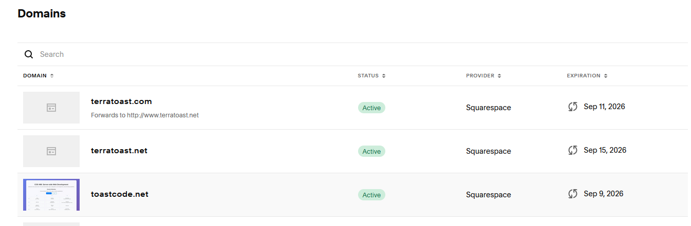
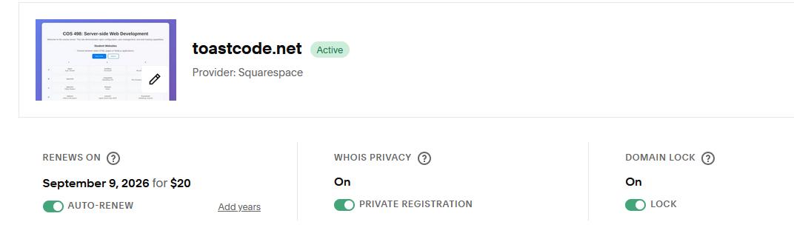
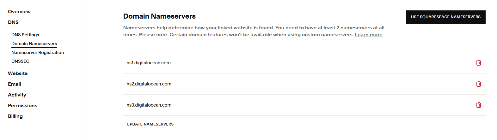
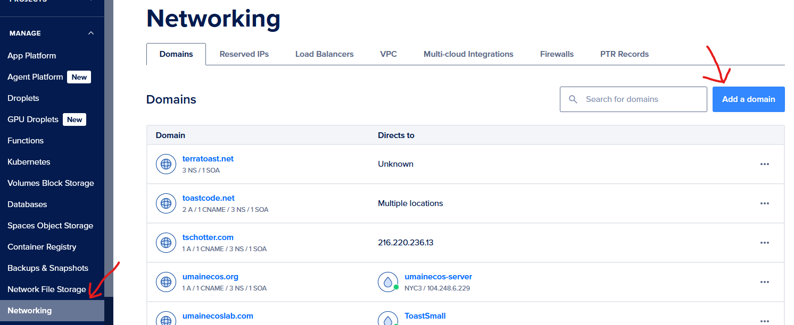
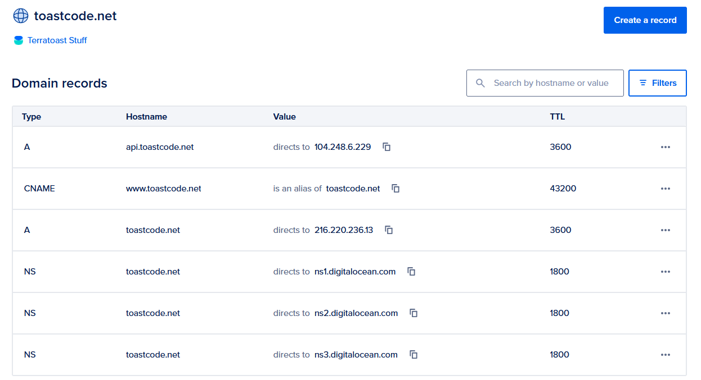

# Getting a Domain Name

When you first set up your server, you access it using an IP address like `192.168.1.100` or `157.230.45.123`. While this works, it's not very user-friendly or memorable. A domain name like `myserver.com` is much easier to remember and looks more professional. In this guide, you'll learn how domain names work and how to get one for your server.

## How Domain Names Work

A domain name is a human-readable address that maps to an IP address. When you type `example.com` into your browser, your computer doesn't know where that is. Instead, it asks a Domain Name System (DNS) server to translate the domain name into an IP address. The DNS server responds with something like `93.184.216.34`, and then your browser connects to that IP address.

Think of it like a phone book: you look up a person's name (domain name) to find their phone number (IP address). The DNS system is the phone book for the internet.

## The Different Parts of a Domain Name

A domain name consists of several parts, separated by dots. Let's break down `www.example.com`:

- **`com`** - This is the **Top-Level Domain (TLD)** or domain extension. Common TLDs include `.com`, `.org`, `.net`, `.edu`, `.gov`, and country-specific ones like `.uk`, `.ca`, `.au`. The TLD indicates the type or location of the website.

- **`example`** - This is the **Second-Level Domain (SLD)** or the main domain name. This is the part you choose when purchasing a domain. It's the unique identifier that makes your domain yours.

- **`www`** - This is a **subdomain**. The `www` part is actually optional and is just a convention. You could use `blog.example.com`, `api.example.com`, or any other subdomain you want. The part before the first dot is always a subdomain.

Here are some examples to illustrate:

- `example.com` - No subdomain, just the domain name
- `www.example.com` - The `www` subdomain
- `blog.example.com` - The `blog` subdomain
- `api.example.com` - The `api` subdomain
- `mail.example.com` - The `mail` subdomain

You can create as many subdomains as you want for your domain without purchasing additional domains. They're all part of the same domain you purchased.

## Who Controls Domain Name Purchasing Rights?

Domain names are managed through a three-tier system:

1. **ICANN (Internet Corporation for Assigned Names and Numbers)** - The global coordinator that oversees the domain name system. ICANN doesn't sell domains directly, but coordinates the entire system.

2. **Registry Operators** - These are the true owners/managers of top-level domains (TLDs). For example:
   - **Verisign** manages `.com` and `.net`
   - **Public Interest Registry** manages `.org`
   - **Afilias** manages `.info`
   - Various organizations manage country-code TLDs like `.uk`, `.ca`, etc.

3. **Domain Registrars** - These are the middlemen that sell domains to consumers. Registrars have agreements with registry operators to sell domains. Popular registrars include:
   - **Namecheap** - Known for competitive pricing and good customer service
   - **GoDaddy** - One of the largest registrars
   - **Google Domains** - Simple interface and integration with Google services
   - **Squarespace** - Offers domain registration along with website hosting
   - **Cloudflare** - Offers domains at cost (no markup)
   - **DigitalOcean** - Can purchase domains directly through their platform

When you purchase a domain from a registrar, you're actually **leasing** it for a period of time (usually 1 year, but you can purchase multiple years). The registrar handles the transaction with the registry operator on your behalf. You don't own the domain forever—you need to renew it periodically through your registrar. If you don't renew, someone else can purchase it.

## The Parts You Can Change in a Domain Name

Once you purchase a domain like `example.com`, you have control over:

1. **Subdomains** - You can create any subdomain you want:
   - `www.example.com`
   - `blog.example.com`
   - `api.example.com`
   - `anything.example.com`

2. **DNS Records** - You control where the domain and its subdomains point:
   - You can point `example.com` to one IP address
   - You can point `www.example.com` to a different IP address
   - You can point `blog.example.com` to yet another IP address or service

3. **Domain Settings** - You can configure:
   - Privacy settings (to hide your personal information)
   - Email forwarding
   - Domain locking (to prevent unauthorized transfers)

You **cannot** change:
- The main domain name itself (you'd need to purchase a new one)
- The TLD extension (`.com` stays `.com`)

## Purchasing a Domain Name

For this guide, we'll walk through purchasing a domain through Squarespace, but the process is similar for other registrars.

### Choose a Domain Name

First, you need to decide on a domain name. Consider:
- Keep it short and memorable
- Avoid hyphens and numbers if possible
- Make sure it's not trademarked
- Check that it's available

### Search for Availability

1. Go to Squarespace's domain registration page
2. Enter your desired domain name
3. Check if it's available and what the price is

If your first choice isn't available, try variations or different TLDs (`.net`, `.org`, etc.).

### Managing Your Purchased Domain

After purchasing your domain, you can view and manage it in your Squarespace account. This is where you'll configure all your domain settings, including nameservers and privacy options.



From this page, you can access your domain's settings. One important setting to configure is **Domain Privacy** (also called WHOIS privacy).



**Important:** Always enable domain privacy! This hides your personal information (name, address, email, phone) from public WHOIS databases. Without privacy, anyone can look up your domain and see your personal information, which can lead to spam, scams, and privacy concerns.

### Configure Nameservers

After purchasing your domain, you need to tell Squarespace to use DigitalOcean's nameservers. This gives DigitalOcean control over your DNS records, which you'll need to point your domain to your server's IP address.

1. In your Squarespace domain settings, find the **Nameservers** section
2. Change the nameservers to DigitalOcean's nameservers:
   - `ns1.digitalocean.com`
   - `ns2.digitalocean.com`
   - `ns3.digitalocean.com`



**Note:** It can take 24-48 hours for nameserver changes to propagate across the internet. This is normal and expected.

## Adding Your Domain to DigitalOcean

Now that your domain is pointing to DigitalOcean's nameservers, you need to add it to your DigitalOcean account so you can manage its DNS records.

### Navigate to Networking

1. Log into your DigitalOcean account
2. Click on **Networking** in the left sidebar
3. Click on **Domains**
4. Click on **Add a domain**




DigitalOcean will automatically create some default DNS records for you.

## Understanding DNS Records

Once your domain is added to DigitalOcean, you'll see a list of DNS records. Let's understand what each type does:



### A Record

An **A record** (Address record) maps a domain or subdomain directly to an IPv4 address. This is what you'll use to point your domain to your server's IP address.

- **Name:** The subdomain (leave blank for the root domain, or enter `www` for the www subdomain)
- **Type:** A
- **Value:** Your server's IP address (e.g., `157.230.45.123`). Digital Ocean has an option to just select a server if you have a server with them.
- **TTL:** Time to live (how long DNS servers cache this record). `3600` seconds (1 hour) is a good default.

Examples:
- An A record with no name (or `@`) pointing to `157.230.45.123` means `example.com` goes to that IP
- An A record with name `www` pointing to `157.230.45.123` means `www.example.com` goes to that IP

### CNAME Record

A **CNAME record** (Canonical Name record) creates an alias that points one domain or subdomain to another domain name. Instead of pointing directly to an IP address, it points to another domain, which then resolves to an IP address.

- **Name:** The subdomain you want to create an alias for
- **Type:** CNAME
- **Value:** The domain name it should point to
- **TTL:** Time to live

Common uses:
- Point `www.example.com` to `example.com` (so both work)
- Point `blog.example.com` to a third-party blogging service
- Point `mail.example.com` to a mail server's domain

**Important:** You cannot create a CNAME record for the root domain (`example.com`). CNAME records can only be used for subdomains. For the root domain, you must use an A record.

### NS Record

An **NS record** (Name Server record) specifies which name servers are authoritative for your domain. These are usually set automatically when you configure nameservers with your registrar, but you might see them in your DNS records.

- **Name:** Usually `@` (for the root domain) or a subdomain
- **Type:** NS
- **Value:** The name server (e.g., `ns1.digitalocean.com`)

You typically don't need to manually create or modify NS records when using DigitalOcean's DNS management.

## Pointing Your Domain to Your Server

Now that you understand DNS records, here's how to point your domain to your server:

### Get Your Server's IP Address

You should already know your server's IP address from when you set it up. If you don't remember, you can find it in your DigitalOcean dashboard under your droplet's details.

### Create an A Record for the Root Domain

1. In DigitalOcean, go to **Networking** → **Domains**
2. Click on your domain name
3. Click **Create new record**
4. Configure the record:
   - **Type:** A
   - **Name:** Leave blank (or use `@`) for the root domain
   - **Value:** Your server's IP address
   - **TTL:** `3600` (or leave default)
5. Click **Create Record**

This makes `example.com` point to your server.

### Create a CNAME Record for www (Optional but Recommended)

Many people expect `www.example.com` to work as well. You have two options:

**Option A: Point www to the root domain (Recommended)**
1. Create a new record
2. Configure:
   - **Type:** CNAME
   - **Name:** `www`
   - **Value:** `example.com` (your root domain)
   - **TTL:** `3600`
3. Click **Create Record**

This makes `www.example.com` point to `example.com`, which then resolves to your IP address.

**Option B: Create an A record for www**
1. Create a new record
2. Configure:
   - **Type:** A
   - **Name:** `www`
   - **Value:** Your server's IP address (same as root domain)
   - **TTL:** `3600`
3. Click **Create Record**

Both options work, but Option A is slightly more flexible if you ever need to change your IP address (you only update one A record instead of two).

### Wait for DNS Propagation

After creating your DNS records, it can take anywhere from a few minutes to 48 hours for the changes to propagate across the internet. This is because DNS servers around the world cache records to improve performance.

You can check if your domain is pointing to your server by:
1. Using a DNS lookup tool like `nslookup` or `dig`:
   ```bash
   nslookup example.com
   ```
2. Or using an online tool like [whatsmydns.net](https://www.whatsmydns.net)

Once propagation is complete, you should be able to access your server using your domain name instead of the IP address!

---

**[Previous: Chapter Overview](index.md)** | **[Next: Proxy Manager and SSL](proxy-manager-and-ssl.md)**

