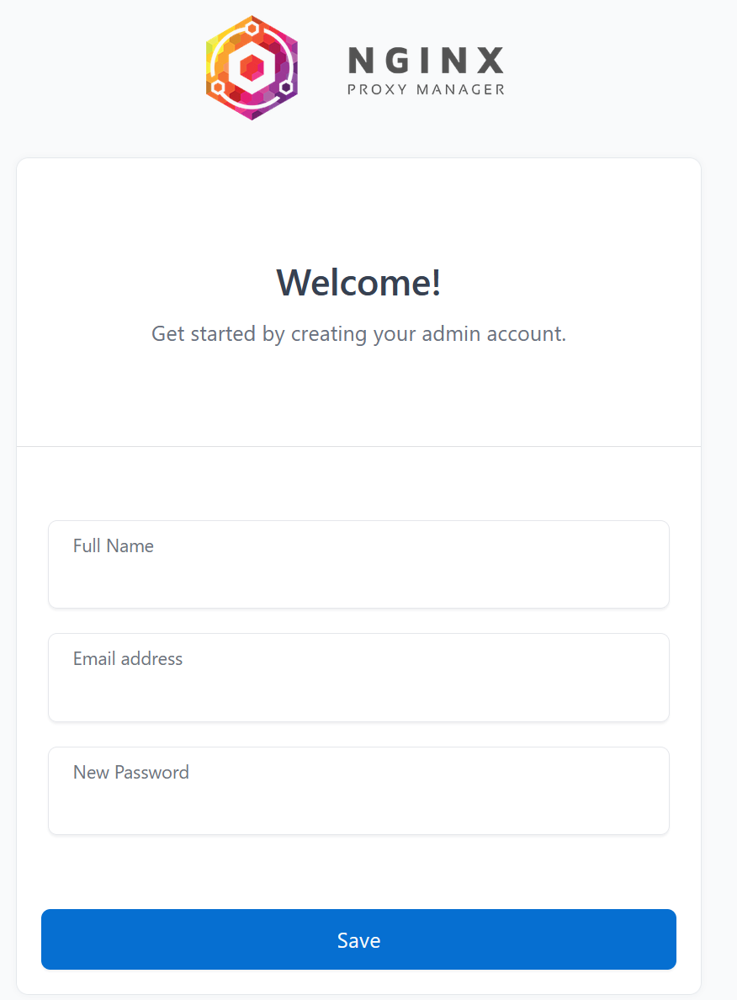
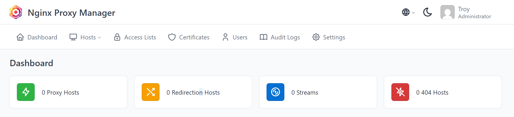
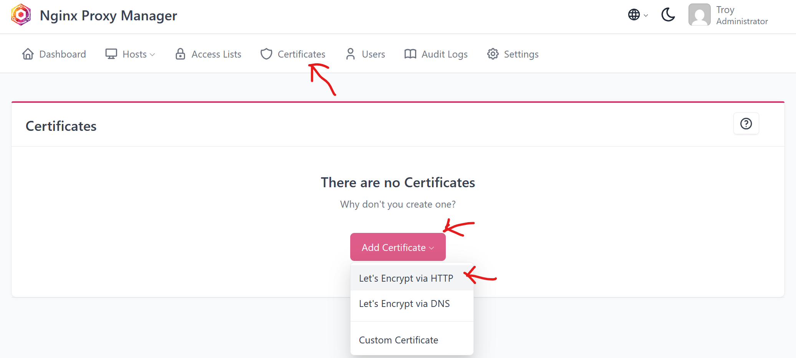
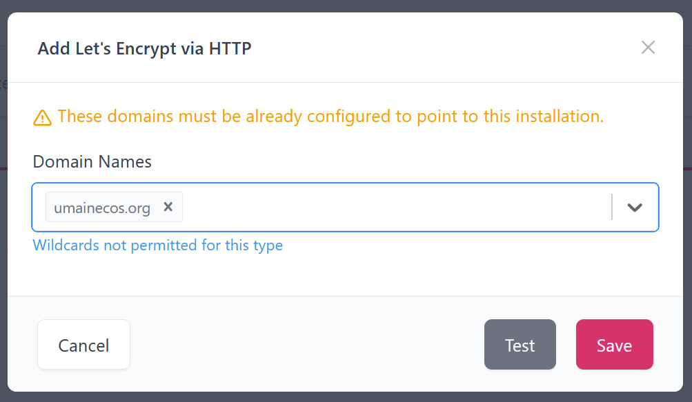
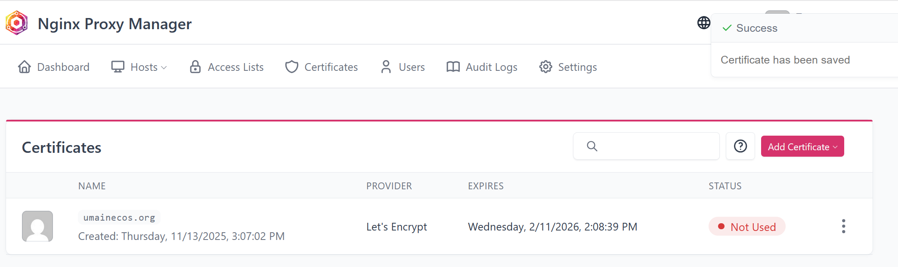
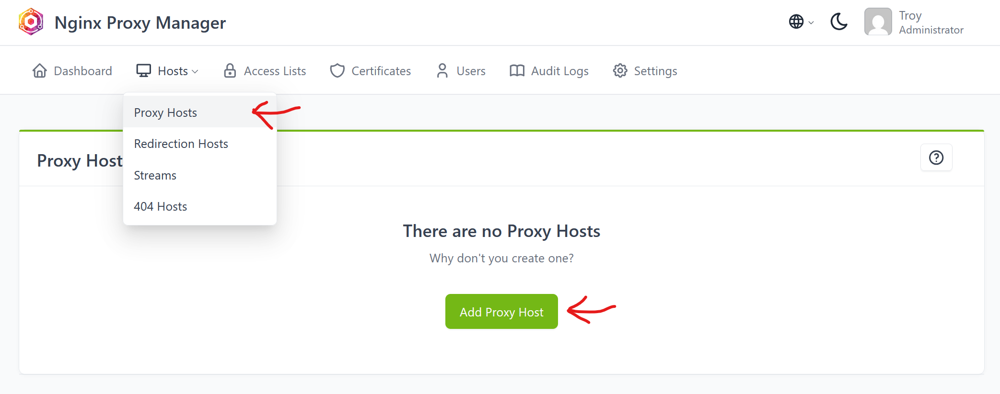
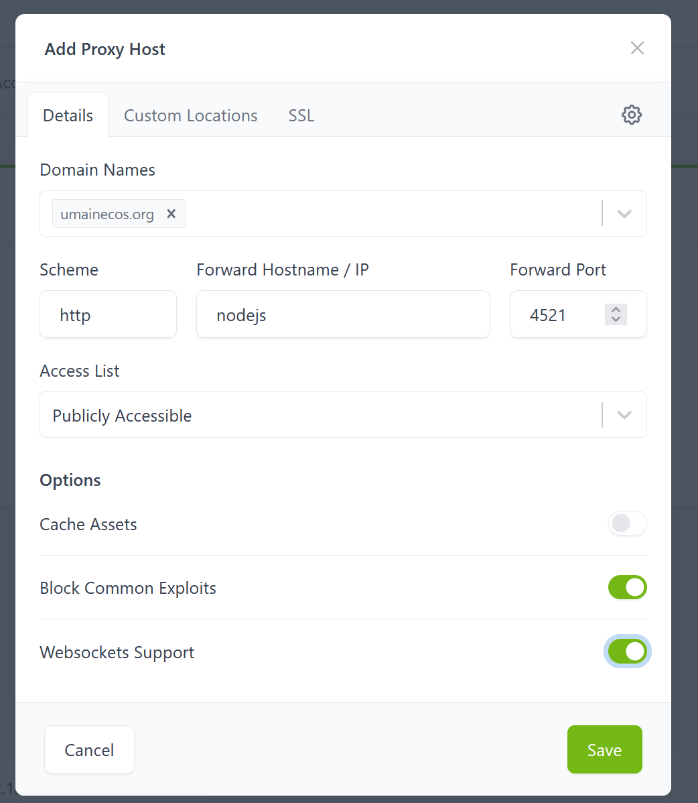
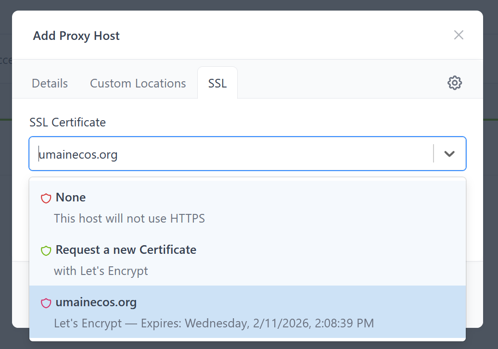
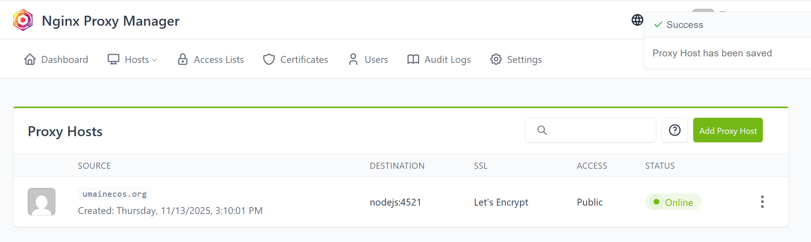
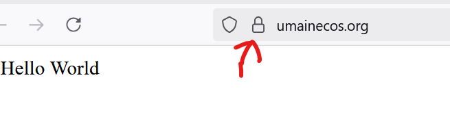

# Proxy Manager and SSL

Now that you have a domain name pointing to your server, you'll want to secure your website with HTTPS. This chapter explains what SSL certificates are, why they're essential for modern websites, and how to use Nginx Proxy Manager to easily manage SSL certificates and reverse proxy configurations.

## What is an SSL Certificate?

An **SSL (Secure Sockets Layer) certificate** is a digital certificate that authenticates a website's identity and enables an encrypted connection between a web server and a web browser. SSL certificates are part of the broader **TLS (Transport Layer Security)** protocol, which is the modern standard (though people still commonly refer to it as SSL).

### How SSL/TLS Works

When you visit a website with HTTPS:

- **Your browser requests a secure connection** to the server
- **The server sends its SSL certificate** to prove its identity
- **Your browser verifies the certificate** is valid and trusted
- **An encrypted connection is established** using cryptographic keys
- **All data transmitted** between your browser and the server is encrypted

This encryption ensures that:
- Data cannot be intercepted and read by third parties
- Data cannot be modified in transit
- You're communicating with the legitimate website (not an imposter)

### Why Sites Need SSL Certificates for HTTPS

**HTTPS (HyperText Transfer Protocol Secure)** is the secure version of HTTP. Here's why SSL certificates are essential:

#### **Security and Privacy**
- **Encrypts data in transit**: Without HTTPS, all data sent between your browser and the server is transmitted in plain text. Anyone intercepting the connection can read passwords, credit card numbers, personal information, and any other sensitive data.
- **Prevents man-in-the-middle attacks**: Attackers can't easily intercept or modify the data being transmitted.

#### **User Trust**
- **Visual indicators**: Browsers display a padlock icon and "Secure" label for HTTPS sites
- **Warning messages**: Modern browsers show prominent warnings for HTTP sites, especially when users try to enter passwords or credit card information
- **Professional appearance**: HTTPS is now expected for all websites, not just e-commerce sites

#### **SEO and Performance Benefits**
- **Search engine ranking**: Google and other search engines favor HTTPS sites in search results
- **Modern web features**: Many modern web APIs (like geolocation, camera access, etc.) require HTTPS
- **HTTP/2 support**: Most browsers only support HTTP/2 over HTTPS, which provides better performance

#### **Browser Requirements**
- **Mixed content warnings**: Browsers block or warn about insecure content (HTTP resources) on HTTPS pages
- **Future-proofing**: Browsers are increasingly restricting HTTP-only features

### Types of SSL Certificates

There are several types of SSL certificates:

**Domain Validated (DV) Certificates**
- Basic validation - only verifies domain ownership
- Fast to obtain (usually automated)
- Free options available (Let's Encrypt)
- Perfect for personal projects and small websites

**Organization Validated (OV) Certificates**
- Verifies domain ownership AND organization details
- More expensive, takes longer to obtain
- Shows organization information in certificate details

**Extended Validation (EV) Certificates**
- Most thorough validation process
- Shows organization name in browser address bar
- Most expensive option
- Typically used by large corporations

For most personal projects and small websites, a **Domain Validated certificate from Let's Encrypt** (which is free) is perfectly adequate.

## Introduction to Nginx Proxy Manager

**Nginx Proxy Manager** is a web-based tool that provides an easy-to-use interface for managing nginx reverse proxy configurations and SSL certificates. Instead of manually editing nginx configuration files and dealing with SSL certificate management through command-line tools, Nginx Proxy Manager gives you a user-friendly dashboard.

### What Nginx Proxy Manager Does

Nginx Proxy Manager:
- **Manages reverse proxy configurations** through a web interface
- **Automatically obtains and renews SSL certificates** using Let's Encrypt
- **Provides a dashboard** to view and manage all your proxy hosts
- **Handles SSL certificate renewal** automatically (certificates expire every 90 days)
- **Supports multiple domains and subdomains** from a single interface
- **Eliminates the need to manually edit nginx config files**
- **Troy doesn't tear his hair out trying to create a script to do it**

### Why Use Nginx Proxy Manager Instead of Standard nginx?

While the standard nginx setup from [Chapter 6](../6-server-setup/docker-nginx-setup.md) works perfectly fine, Nginx Proxy Manager offers several advantages:

- **Easier SSL Management**: No need to manually configure Let's Encrypt certificates or set up renewal cron jobs
- **User-Friendly Interface**: Configure everything through a web browser instead of editing configuration files
- **Automatic Certificate Renewal**: Handles SSL certificate renewal automatically
- **Multiple Domains**: Easily manage multiple domains and subdomains from one interface
- **Less Configuration**: No need to create custom nginx configuration files or Dockerfiles
- **Access Control**: Built-in access lists and authentication options

### When to Use Each Approach

- **Use standard nginx** when:
  - You need fine-grained control over nginx configuration
  - You want to learn nginx configuration in depth
  - You have specific, complex routing requirements
  - You prefer managing everything through configuration files

- **Use Nginx Proxy Manager** when:
  - You want an easier way to manage SSL certificates
  - You're managing multiple domains/subdomains
  - You prefer a graphical interface
  - You want automatic SSL certificate renewal
  - You're setting up a production server quickly

## Modifying Docker Compose for Nginx Proxy Manager

To use Nginx Proxy Manager instead of the standard nginx setup from Chapter 6, you'll need to modify your `docker-compose.yml` file. Here's what needs to change:

### Original Docker Compose Setup

In Chapter 6, your `docker-compose.yml` looked something like this:

```yaml
services:
  # Node.js Express application
  backend-nodejs:
    build: ./backend
    container_name: backend-nodejs
    restart: unless-stopped
    environment:
      - NODE_ENV=production
      - PORT=3000
    networks:
      - app-network

  # nginx reverse proxy
  nginx:
    build: ./nginx
    container_name: my-nginx-proxy
    restart: unless-stopped
    ports:
      - "80:80"  # Only nginx exposes ports to the host
    depends_on:
      - backend-nodejs
    networks:
      - app-network

networks:
  app-network:
    driver: bridge
```

### Updated Docker Compose with Nginx Proxy Manager

Here's how to modify it to use Nginx Proxy Manager:

```yaml
services:
  # Node.js Express application
  backend-nodejs:
    build: ./backend
    container_name: backend-nodejs
    restart: unless-stopped
    environment:
      - NODE_ENV=production
      - PORT=3000
    networks:
      - app-network

  # Nginx Proxy Manager
  nginx-proxy-manager:
    image: 'jc21/nginx-proxy-manager:latest'
    container_name: nginx-proxy-manager
    restart: unless-stopped
    ports:
      - '80:80'      # HTTP traffic
      - '443:443'    # HTTPS traffic
      - '5001:81'    # Admin web interface, pick an unusual port for security
    volumes: # place to store all the data that we need persistant and external
      - ./nginx/data:/data
      - ./nginx/letsencrypt:/etc/letsencrypt
    networks:
      - app-network

networks:
  app-network:
    driver: bridge
```

### Key Changes Explained

#### **Replaced Custom nginx Service**

**Before:**
```yaml
nginx:
  build: ./nginx
  container_name: my-nginx-proxy
```

**After:**
```yaml
nginx-proxy-manager:
  image: 'jc21/nginx-proxy-manager:latest'
  container_name: nginx-proxy-manager
```

- **No longer building from a Dockerfile**: Nginx Proxy Manager uses a pre-built image from Docker Hub
- **No need for custom nginx configuration files**: The proxy manager handles configuration internally
- **No need for the `nginx/` directory**: Though I've chosen to still use it to keep the nginx related files stored in a seperate folder. **If you're using github, add this folder to the ignore list**.

#### **Additional Ports**

**Before:**
```yaml
ports:
  - "80:80"
```

**After:**
```yaml
ports:
  - '80:80'      # HTTP traffic
  - '443:443'    # HTTPS traffic
  - '5001:81'      # Admin web interface
```

- **Port 80**: HTTP traffic (will redirect to HTTPS once SSL is configured)
- **Port 443**: HTTPS traffic (secure connections)
- **Port 81**: Web interface to manage Nginx Proxy Manager (access at `http://your-server-ip:5001`)

#### **Volume Mounts**

**New addition:**
```yaml
volumes:
  - ./nginx/data:/data
  - ./nginx/letsencrypt:/etc/letsencrypt
```

- **`./nginx/data:/data`**: Stores Nginx Proxy Manager's configuration, database, and logs in a seperate nginx folder
- **`./nginx/letsencrypt:/etc/letsencrypt`**: Stores SSL certificates obtained from Let's Encrypt

These volumes persist your configuration and certificates even if you restart or recreate the container.

#### **Removed Dependencies**

**Before:**
```yaml
depends_on:
  - backend-nodejs
```

**After:**
- **Removed**: Nginx Proxy Manager doesn't need to know about other containers at startup. You'll configure the proxy relationships through the web interface.

### What You Can Remove

With Nginx Proxy Manager, you no longer need:

- **The `nginx/` directory**:
  - `nginx/Dockerfile`
  - `nginx/default.conf`
  - `nginx/public/` (static files can be served by your backend or a separate container)

- **Custom nginx configuration**: All configuration is done through the web interface

### What Stays the Same

- **Your backend container**: No changes needed to your Node.js application
- **The network setup**: Still using a custom Docker network for container communication
- **Your backend code**: No changes needed to your Express.js application

## Next Steps

After updating your `docker-compose.yml`:

- **Start the services**: `docker compose up -d`
- **Access the admin interface**: Navigate to `http://your-server-ip:5001`
- **Set up your first proxy host**: Configure your domain to point to your backend container
- **Request an SSL certificate**: Use the built-in Let's Encrypt integration

The Nginx Proxy Manager interface will guide you through setting up your first proxy host and obtaining an SSL certificate. You'll be able to configure everything through the web interface without editing any configuration files.

## Getting SSL Certificates and setting up proxy

Now that you have Nginx Proxy Manager running, let's set up SSL certificates and configure your proxy to route traffic to your Node.js server. This process involves two main steps:

1. **Obtaining an SSL certificate** from Let's Encrypt
2. **Configuring a proxy host** to route your domain to your Node.js container

### Step 1: Accessing the Admin Interface

First, navigate to the Nginx Proxy Manager admin interface. Open your web browser and go to:

```
http://your-server-ip:5001
```

Replace `your-server-ip` with your actual server's IP address.

### Step 2: Creating Your Admin Account

When you first access the admin interface, you'll be prompted to create an admin account. This account will be used to manage all your proxy configurations and SSL certificates.



Enter your desired email address and password, then click "Sign In" to create your account and log in.

### Step 3: Viewing the Dashboard

After logging in, you'll see the Nginx Proxy Manager dashboard. Initially, it will be empty since you haven't configured any proxy hosts yet.




### Step 4: Obtaining an SSL Certificate

Before setting up your proxy host, let's obtain an SSL certificate for your domain. This ensures your site will be accessible via HTTPS.

1. Click on the **"SSL Certificates"** tab in the top navigation
2. Click the **"Add SSL Certificate"** button
3. Select **"Let's Encrypt"** as the certificate type
4. Choose **"Request a new SSL Certificate with Let's Encrypt"**



5. In the certificate creation form, you'll need to enter:
   - **Domain Names**: Enter your domain name (e.g., `example.com`). If you want to include both `www` and non-`www` versions, you can add multiple domains: `example.com, www.example.com`. Hit "enter" to actually add in the domain name once you're done typing (don't click off of it). Clicking off the textbox will reset it.
 


6. Click **"Save"** to request the certificate

Let's Encrypt will verify that you own the domain by checking that it points to your server. This process usually takes a few seconds to a minute. Make sure your domain's DNS records are properly configured (as described in the previous chapter) before requesting the certificate.

### Step 5: Verifying Certificate Creation

Once the certificate is successfully created, you'll see it listed in the SSL Certificates tab. The certificate will show:
- Your domain name(s)
- The expiration date (Let's Encrypt certificates are valid for 90 days and renew automatically)
- The certificate status



**Note**: Let's Encrypt certificates automatically renew before expiration, so you don't need to worry about manually renewing them.

### Step 6: Setting Up Your Proxy Host

Now that you have an SSL certificate, it's time to configure your proxy host to route traffic from your domain to your Node.js container.

1. Click on the **"Hosts"** tab in the top navigation
2. Click on **"Proxy Hosts"**
3. Click the **"Add Proxy Host"** button



### Step 7: Configuring Proxy Host Details

In the "Details" tab of the proxy host configuration, you'll need to enter:

- **Domain Names**: Enter your domain name (the same one you used for the SSL certificate). For example: `example.com` or `www.example.com`. You can add multiple domains separated by commas if needed.

- **Scheme**: Select **`http`** (not `https`). This is the protocol your Node.js container uses internally. Nginx Proxy Manager will handle the HTTPS encryption between the client and the proxy, then forward requests to your container over HTTP.

- **Forward Hostname / IP**: Enter your **Node.js container name** (not the domain name!). This is the `container_name` you specified in your `docker-compose.yml` file. For example, if your container is named `backend-nodejs`, enter `backend-nodejs`.

- **Forward Port**: Enter the port your Node.js server is listening on. This is typically `3000` (or whatever port you configured in your Node.js application's `PORT` environment variable).



#### Additional Security Options

While configuring the proxy host, you'll see several security and feature options. Two important ones to enable are:

**Block Common Exploits**: This option enables nginx's built-in protection against common web exploits and attacks. It includes:
- Protection against SQL injection attempts
- Protection against cross-site scripting (XSS) attacks
- Protection against common HTTP request smuggling attacks
- Blocking of suspicious user agents and request patterns

**Websocket Support**: Enable this if your application uses WebSockets (real-time bidirectional communication). Even if you're not currently using WebSockets, enabling this option won't hurt and will allow you to add WebSocket functionality later without reconfiguring the proxy. WebSockets are commonly used for:
- Real-time chat applications
- Live notifications
- Real-time data updates
- Interactive applications that need persistent connections

Make sure both of these options are checked (enabled) for better security and functionality.

### Step 8: Adding SSL to Your Proxy Host

After configuring the basic proxy details, you need to add the SSL certificate you created earlier.

1. Click on the **"SSL"** tab in the proxy host configuration popup
2. Under "SSL Certificate", select the certificate you created in Step 4 from the dropdown menu
3. **Enable "Force SSL"**: This option automatically redirects all HTTP traffic to HTTPS. When enabled, if someone tries to access your site using `http://example.com`, they'll be automatically redirected to `https://example.com`. This ensures all traffic to your site is encrypted.



4. Click **"Save"** to complete the proxy host configuration

### Step 9: Verifying Your Configuration

After saving, you'll be returned to the Proxy Hosts dashboard. You should now see your proxy host listed with:
- Your domain name
- The forwarding destination (your container name and port)
- The SSL certificate status
- Whether SSL is forced



### Step 10: Testing Your HTTPS Site

Now it's time to test that everything is working! Open your web browser and navigate to your domain:

```
https://your-domain.com
```

You should see:
- **A padlock icon** in your browser's address bar
- **"Secure" or "Connection is secure"** message
- Your Node.js application loading correctly



If you see the padlock icon, congratulations! Your site is now accessible via HTTPS with a valid SSL certificate.


### What Happens Next?

Your SSL certificate will automatically renew every 90 days. Nginx Proxy Manager handles this automatically, so you don't need to do anything. Your site will continue to work with HTTPS without interruption.

You can add more proxy hosts for additional domains or subdomains by repeating the process above. Each proxy host can point to a different container or port, allowing you to host multiple applications on the same server.

---

**[Previous: Getting a Domain Name](getting-a-domain-name.md)** | **[Return to Chapter Overview](index.md)**