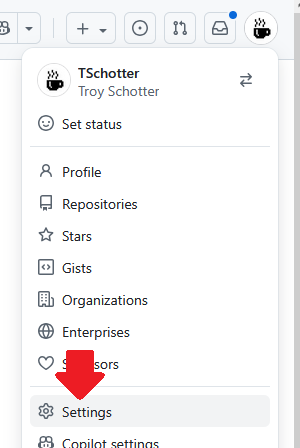
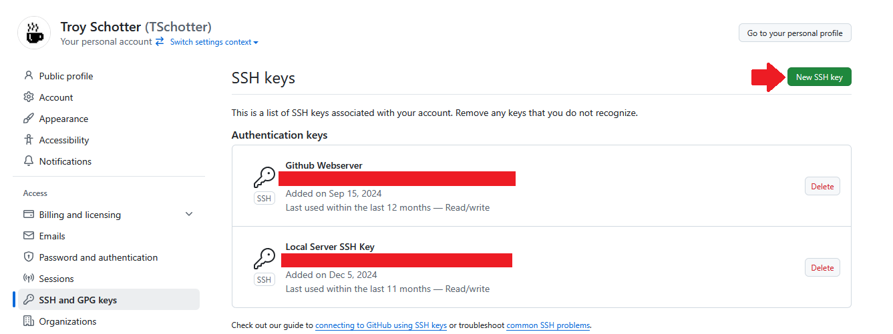
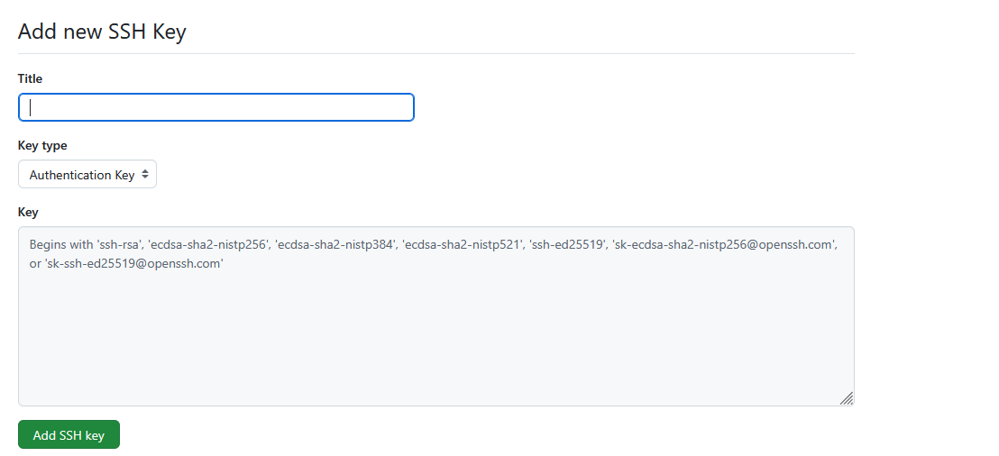

# GitHub Terminal Connection

Now that you have your server secured and SSH keys set up, it's time to connect your server to GitHub so you can easily push and pull code from your repositories. This chapter will walk you through the process of setting up GitHub authentication from your server's terminal.

## What You'll Learn

In this chapter, you'll learn how to:

- Generate SSH keys specifically for GitHub
- Add your SSH public key to your GitHub account
- Test your GitHub connection
- Clone repositories and push code from your server
- Configure Git with your identity

## Prerequisites

Before starting this chapter, make sure you have:

- Completed the [Essential Server Security](essential-security.md) chapter
- A GitHub account
- SSH access to your server
- Basic familiarity with terminal commands

## Step 1: Generate SSH Keys for GitHub

First, let's generate a new SSH key pair specifically for GitHub. While you could use the same key you created for server access, it's a good practice to use separate keys for different services.

```bash
# Generate a new SSH key for GitHub
ssh-keygen -t ed25519 -C "Example Remote Server" -f ~/.ssh/github_key
```

When prompted:
- **Enter a passphrase** (recommended for security) or press Enter for no passphrase
- The key will be saved as `~/.ssh/github_key` (private) and `~/.ssh/github_key.pub` (public)

## Step 2: Test Your SSH Key

Let's test that your SSH key was created correctly:

```bash
# Display your public key to verify it was created
cat ~/.ssh/github_key.pub
```

You should see output starting with `ssh-ed25519` followed by your comment you left with the -C.

## Step 3: Configure SSH for GitHub

Since we're using a custom key name (`github_key` instead of the default), we need to tell SSH which key to use when connecting to GitHub. Create an SSH config file:

```bash
# Create or edit SSH config file
nano ~/.ssh/config
```

Add the following configuration:

```
Host github.com
    HostName github.com
    User git
    IdentityFile ~/.ssh/github_key
    IdentitiesOnly yes
```

Save the file (Ctrl+X, then Y, then Enter in nano).

This configuration tells SSH to:
- Use your custom `github_key` when connecting to GitHub
- Only use the specified key (not try other keys)
- Connect as the `git` user (required for GitHub)

## Step 4: Copy Your Public Key

You need to copy your public key to add it to GitHub. Since we already displayed it in the previous step, you can copy it from your terminal output. If you need to see it again:

```bash
# Display your public key
cat ~/.ssh/github_key.pub
```

Copy the entire output (it should start with `ssh-ed25519` and end with your comment).

## Step 5: Add SSH Key to GitHub

Now you need to add your public key to your GitHub account:

1. **Go to GitHub Settings**
   - Click on your profile picture in the top-right corner
   - Select "Settings" from the dropdown menu

   

2. **Navigate to SSH Keys**
   - In the left sidebar, click on "SSH and GPG keys"

   

3. **Add New SSH Key**
   - Click the "New SSH key" button
   - Give your key a descriptive title (e.g., "My Server - Ubuntu 22.04")
   - Paste your public key into the "Key" field
   - Click "Add SSH key"

   

## Step 6: Test Your GitHub Connection

Test that your SSH connection to GitHub is working:

```bash
# Test SSH connection to GitHub
ssh -T git@github.com
```

You should see a message like:
```
Hi username! You've successfully authenticated, but GitHub does not provide shell access.
```

If you see this message, congratulations! Your GitHub connection is working.

## Step 7: Configure Git Identity

Set up your Git identity on the server:

```bash
# Set your name and email for Git commits
git config --global user.name "Your Name"
git config --global user.email "your-email@example.com"

# Verify your configuration
git config --global --list
```

## Step 8: Clone a Repository

Now you can clone repositories from GitHub:

```bash
# Clone a repository using SSH
git clone git@github.com:username/repository-name.git

# Navigate into the cloned repository
cd repository-name
```

## Step 9: Create and Push to a Repository

Let's create a simple test repository to verify everything works:

```bash
# Create a new directory for your test project
mkdir github-test
cd github-test

# Initialize a Git repository
git init

# Create a simple test file
echo "# GitHub Connection Test" > README.md

# Add the file to Git
git add README.md

# Commit the changes
git commit -m "Initial commit - testing GitHub connection"

# Add your GitHub repository as the remote origin
git remote add origin git@github.com:username/your-repo-name.git

# Push to GitHub
git push -u origin main
```

## Troubleshooting Common Issues

### Permission Denied Error

If you get a "Permission denied (publickey)" error:

1. Make sure you're using the correct SSH key file path
2. Verify your public key is correctly added to your GitHub account
3. Test the connection again:
   ```bash
   ssh -T git@github.com
   ```
4. If you set a passphrase, make sure you're entering it correctly when prompted

### Wrong SSH Key Being Used

If GitHub is using the wrong SSH key, make sure you've created the SSH config file as described in Step 3. The config file should specify which key to use for GitHub connections.

### Git Push Requires Username/Password

If Git asks for username and password when pushing:

1. Make sure you're using the SSH URL (`git@github.com:username/repo.git`) not HTTPS
2. Check that your SSH key is properly added to GitHub
3. Verify your SSH connection with `ssh -T git@github.com`

## Best Practices

### Key Management
- Use different SSH keys for different services
- Occationally update your SSH keys. Don't use the same SSH key for years.
- Use passphrases for your private keys
- Never share your private keys

### Repository Security
- Use SSH URLs instead of HTTPS for better security
- Regularly review and remove unused SSH keys from your GitHub account


## Next Steps

Now that you have GitHub connected to your server, you can:

- Clone existing repositories
- Create new projects and push them to GitHub
- Collaborate with others on shared repositories
- Set up automated deployments from GitHub

## Summary

In this chapter, you learned how to:

✅ Generate SSH keys specifically for GitHub  
✅ Add your SSH public key to your GitHub account  
✅ Test your GitHub connection  
✅ Configure Git with your identity  
✅ Clone and push to repositories  

Your server is now ready to work with GitHub repositories! In the next chapter, we'll explore more advanced server configuration topics.

---

**Quick Reference Commands:**

```bash
# Generate SSH key for GitHub
ssh-keygen -t ed25519 -C "your-email@example.com" -f ~/.ssh/github_key

# Test GitHub connection
ssh -T git@github.com

# Configure Git identity
git config --global user.name "Your Name"
git config --global user.email "your-email@example.com"

# Clone repository
git clone git@github.com:username/repository-name.git
```
